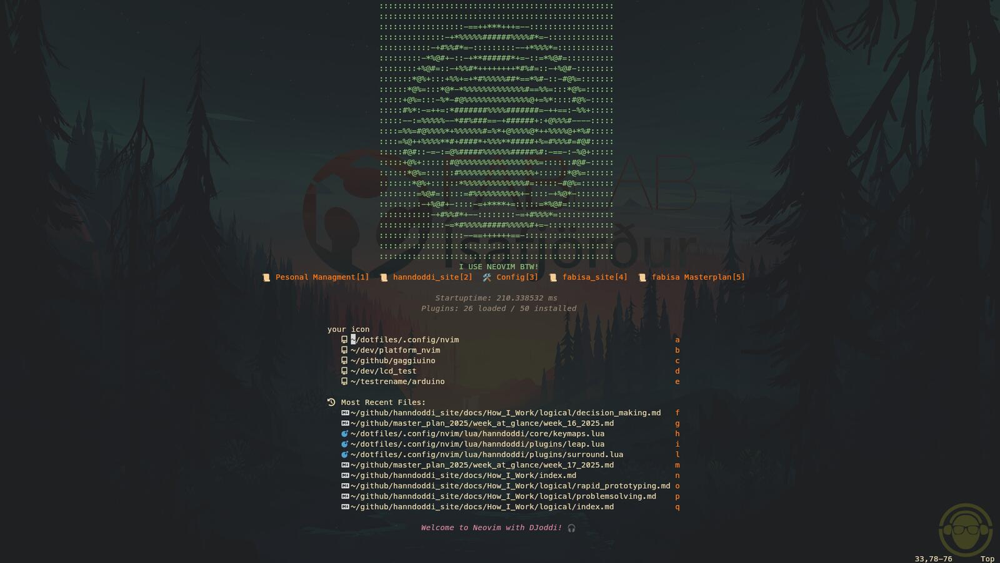
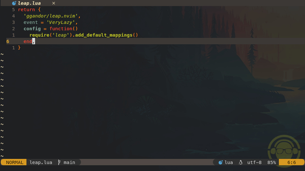

# Neovim (I use Neovim btw)

I mainly started using Neovim because I wanted to look like a cool hacker. (Don’t worry, I’m not much of a danger)

After getting over how cool it looked and spending days configuring it, I discovered that it’s actually a really nice workflow.



---

## Setup

{ align=right }

For anyone just starting out, I’d recommend checking out [kickstart nvim](https://github.com/nvim-lua/kickstart.nvim ).  
It’s a great minimal starter config.

There’s also [this video](https://youtu.be/6pAG3BHurdM?si=Q-vdsjJOm6IU9Qy6)  that I *really* wish I’d found earlier.

My Neovim setup has gone through a few iterations, but I’ve restructured it for my needs mainly for embedded electronics and markdown.
I now use my own custom setup, inspired by Kickstart and a few other configs I’ve found along the way.

---

## What I’m Using

- ✅ **Neovim 0.12** (manually installed from official tarball)
- ✅ Lazy as plugin manager
- ✅ Modular Lua config under `~/.config/nvim/lua/hanndoddi`
- ✅ Custom dashboard with personal shortcuts
- ✅ Treesitter, Mason, LSP, formatting, linting all working
- ✅ Micropython and Platform.io
- ✅ Transparent theme + icons
- ✅ Lazy Git

## Structure

I split things into modular Lua files for easier organization and customization.

My config is split into:

```
~/.config/nvim/
├── init.lua
├── lua/
│   └── hanndoddi/
│       ├── core/       -- Basic options, keymaps
│       ├── plugins/    -- Plugin configs
│       ├── lazy.lua    -- Lazy plugin setup
│       └── init.lua    -- Main entry point
```

## Notable Plugins


- **lualine** - statusline
- **telescope** - fuzzy finder
- **nvim-tree** - file explorer
- **vim-visual-multi** - multi-cursor
- **todo-comments** - highlight and search TODOs
- **surround**, **substitute**, **comment** - editing helpers
- **formatter**, **linter**, **gitsigns**
- **leap** - moving around fast

## My favorite vim motions and keybinds

- **gcc** - convert to comment and uncomment
- **space+x** - Check tasks

## Update Process

I use two options for updating Neovim depending on whether it’s a big update or it’s been a while since I last updated.

### Option 1 - Quick Test (AppImage)

I use this to test a new version safely before installing system-wide to check if anything breaks.

```bash
cd /tmp
wget https://github.com/neovim/neovim/releases/latest/download/nvim-linux-x86_64.appimage

chmod +x nvim-linux-x86_64.appimage
./nvim-linux-x86_64.appimage
```

**Notes:**

- Runs Neovim without installing anything
- Uses my existing config (`~/.config/nvim`)
- Good for testing compatibility before upgrading
- Does not affect your system version

------

### Option 2 - System-wide Install (/opt)

This is the main installation/update method if I'm sure nothing critical will break. This replaces the existing Neovim binary but keeps my config and plugins intact.

```bash
cd /tmp
curl -LO https://github.com/neovim/neovim/releases/latest/download/nvim-linux-x86_64.tar.gz

sudo rm -rf /opt/nvim-linux-x86_64
sudo tar -C /opt -xzf nvim-linux-x86_64.tar.gz
```

**Symlink (only needed once):**

```
sudo ln -sf /opt/nvim-linux-x86_64/bin/nvim /usr/local/bin/nvim
```

------

### Verify Installation

I use this to make sure everything works like before. I also run `:checkhealth` before and after updating and compare the results.

```
which nvim
nvim --version
ls -l /usr/local/bin/nvim
```

Expected:

- `nvim` → `/usr/local/bin/nvim`
- version matches installed release
- symlink points to `/opt/nvim-linux-x86_64/bin/nvim`


---

## Thoughts

You’re more than welcome to explore (or fork) my Neovim config.  
But I highly recommend customizing it to suit **your** needs.
I'm Still exploring deeper workflows like native multi-cursor editing, but happy with the current state.

My take:
- Don’t force Neovim to act like VS Code.
- If you’re happy with your current editor - keep using it!

Neovim is awesome if it works for you.  
Happens to work for me.

!!! Note
    [My jouney to Nvim post](../../../../journal/posts/journey_to_nvim.md)

!!! Info
    [My Dotfiles](../../../../journal/posts/journey_to_nvim.md)
