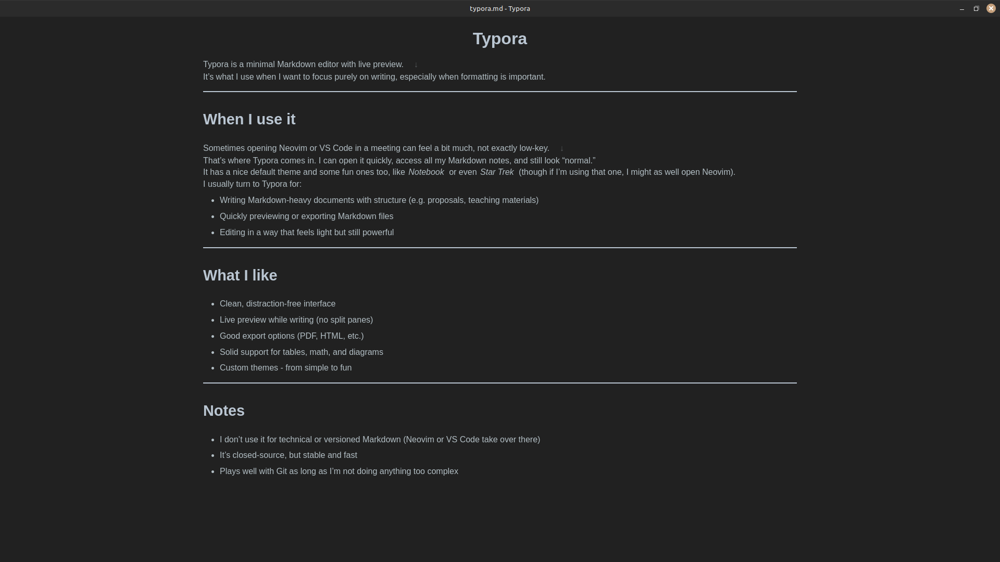
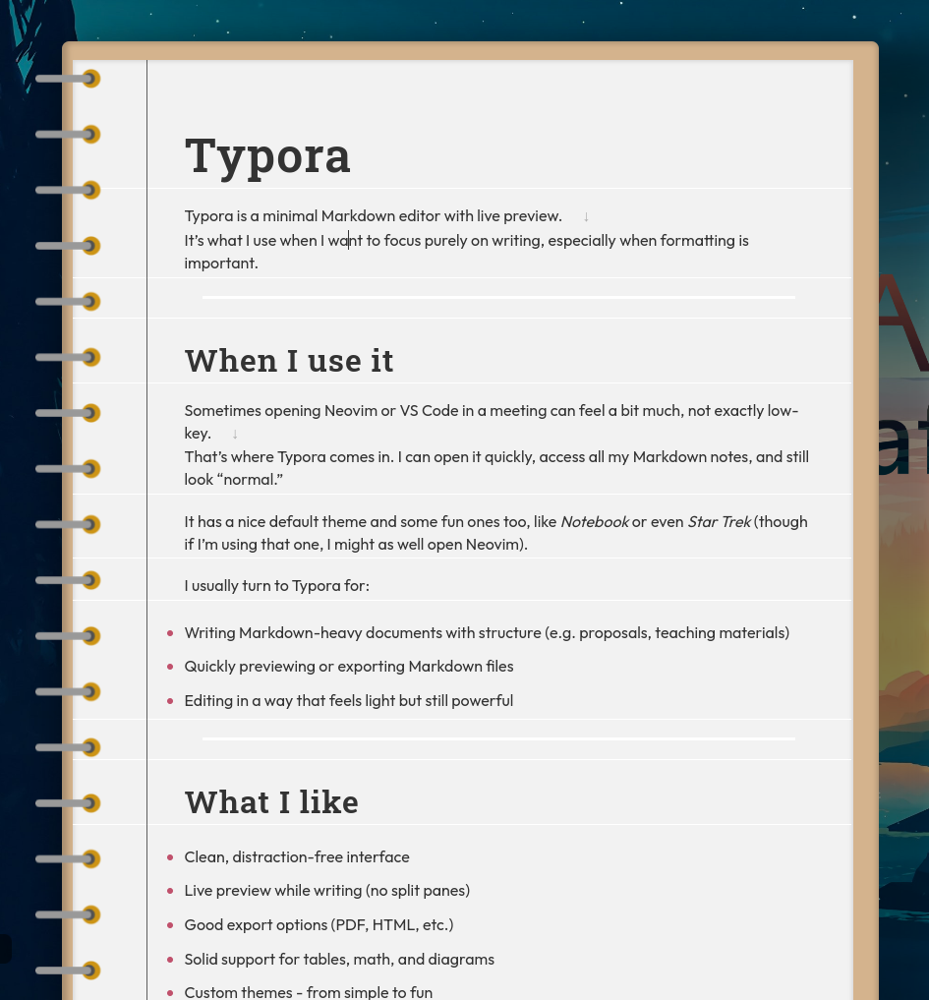
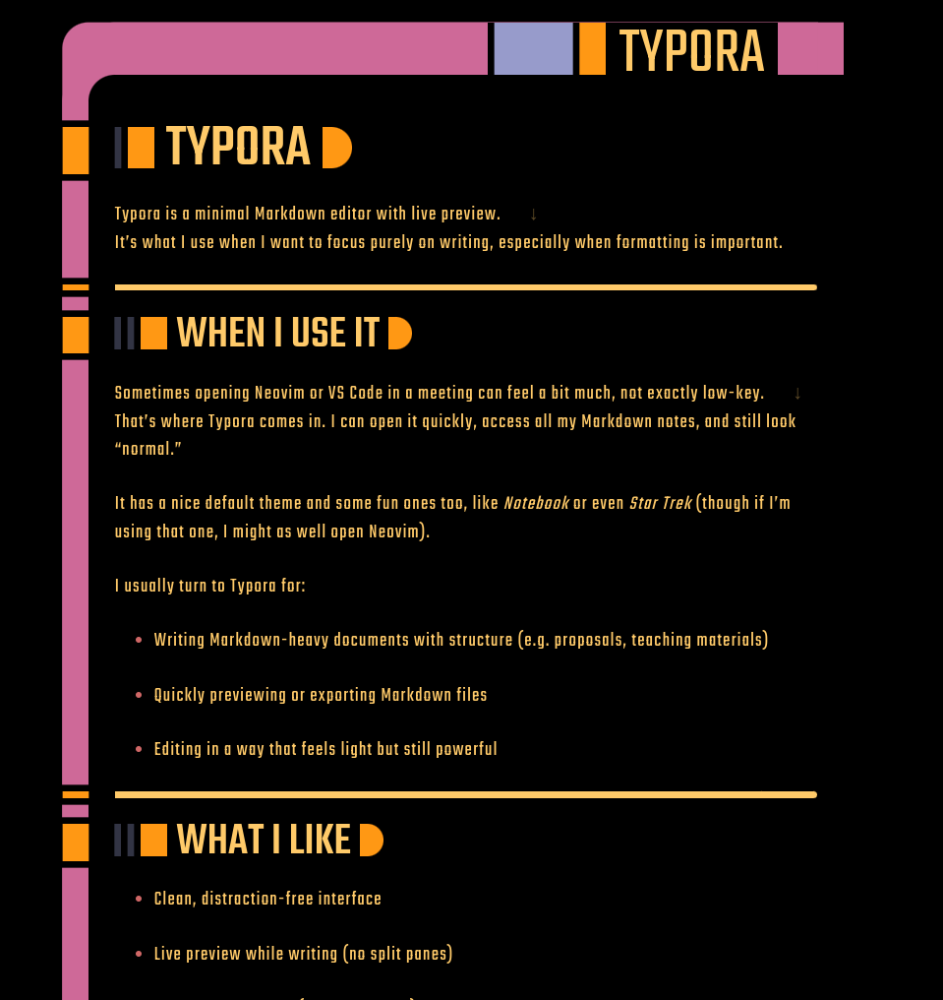

# Typora

Typora is a minimal Markdown editor with live preview.  
It’s what I use when I want to focus purely on writing, especially when formatting is important.

---

## When I use it
{: style="height:60%;width:60%" align=right} 

Sometimes opening Neovim or VS Code in a meeting can feel a bit much, not exactly low-key.  
That’s where Typora comes in. I can open it quickly, access all my Markdown notes, and still look “normal.”

It has a nice default theme and some fun ones too, like *Notebook* or even *Star Trek* (though if I’m using that one, I might as well open Neovim).

I usually turn to Typora for:

- Writing Markdown-heavy documents with structure (e.g. proposals, teaching materials)
- Quickly previewing or exporting Markdown files
- Editing in a way that feels light but still powerful
- 

---

## What I like

- Clean, distraction-free interface
- Live preview while writing (no split panes)
- Good export options (PDF, HTML, etc.)
- Solid support for tables, math, and diagrams
- Custom themes - from simple to fun

---

## Notes

- I don’t use it for technical or versioned Markdown (Neovim or VS Code take over there)
- It’s closed-source, but stable and fast
- Plays well with Git as long as I’m not doing anything too complex
- Yes, this page about Typora was written in Typora

{: style="height:47%;width:47%" align=left} 
{: style="height:47%;width:47%" align=right} 