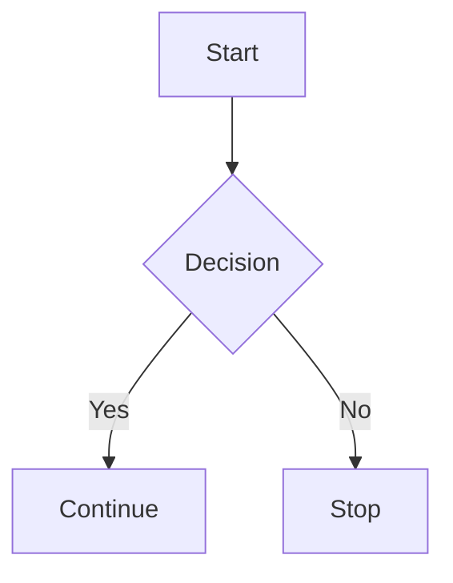

# Markdown 

One of the best things I’ve learned. I use Markdown almost hourly.

It allows me to take notes quickly, stay organized, and document everything from simple lists to full websites. This entire page is written in Markdown.

---

## Why I Love It

- **Speed** — I can type without reaching for the mouse or formatting toolbar
- **Clarity** — My thoughts stay focused, not distracted by styling
- **Portability** — It works in editors, terminals, websites, and documentation tools
- **Control** — Especially when paired with tools like MkDocs, I can build fast websites with full control over layout and style

---

## Everyday Uses

- Taking meeting notes
- Planning projects and to-do lists
- Writing documentation and assignments
- journaling
- Structuring webpages

---

## Favorite Features

- `#` Headings for structure
- `-` Lists for everything
- ``` code blocks ``` for technical documentation
- Inline formatting with `*italics*`, `**bold**`, and [links](https://example.com)
- Embedding images for visual notes and guides

---

## Markdown + MkDocs = 🚀

Being able to turn Markdown into a full-featured website is incredibly empowering. It keeps writing and editing fast, and styling is handled separately, which means I can stay in flow.

---

## Extended Power 💡

I also use Markdown beyond the basics — thanks to MkDocs Material and its extensions:

### 🧠 Diagrams with Mermaid

Useful for planning systems and flows:

```markdown


```
### 📐 Math formulas with KaTeX

Write equations in LaTeX-style syntax:

```markdown
$$ E = mc^2 $$
```

### ✅ Task Lists

```markdown
- [x] Write draft
- [ ] Revise section
- [ ] Publish
```

### Admonitions (Notes, Tips, Warnings)

For adding visual callouts using:

```markdown
!!! note
    This is a note.

!!! warning
    This is a warning.
```

---

## Tools I Use

- **VS Code** and **Neovim** — for writing Markdown
- **Glow** — for previewing in the terminal
- **Markdown PDF extension** — for exporting styled PDFs
- **MkDocs Material** — for building this site
- **typora**

---

## Tips for Future Me

- Explore Markdown extensions like footnotes, callouts, and collapsibles
- Try out static site generators beyond MkDocs (like Astro, Eleventy, etc.)
- Keep it simple — Markdown is best when it stays minimal

---

## Resources

- [Markdown Guide](https://www.markdownguide.org/)
- [MkDocs Material](https://squidfunk.github.io/mkdocs-material/)
- [Mermaid Docs](https://mermaid.js.org/)
- [KaTeX Docs](https://katex.org/)
