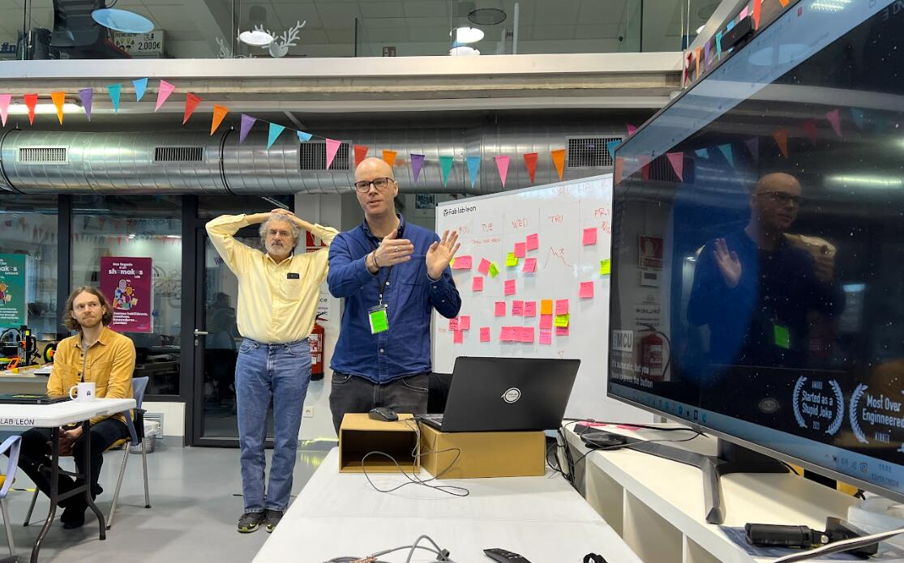

# Critical Thinking

Critical thinking is a valuable skill to nurture I use it in varius situation. It helps me ask better questions, see the bigger picture, and avoid wasting time on false assumptions.

Whether I’m teaching, designing a system, reviewing ideas with a team, or just trying to get something to work, this mindset helps me stay grounded and focused on what actually matters.

## Reasoning

I don’t rush into solutions I like to start with asking *why*. Why is this happening? Why is this the approach we’re taking? Why hasn’t it worked yet?

Reasoning helps me:
- Work from observations instead of assumptions  
- Understand how something is supposed to behave before reacting  
- Break complex issues into simpler cause-and-effect steps  
- Explain my thinking clearly to others (or to myself)

Sometimes this means sketching diagrams. Other times, just talking it out loud reveals the gap.

## Attention to Detail

Most misunderstandings, mistakes, or confusion come from something small. A misplaced word. A missed context. A setting left unchecked.

Paying attention to detail helps me:
- Catch errors early, whether technical or communicative  
- Review content and ideas more thoughtfully  
- Stay consistent across design, planning, and collaboration

This isn’t about being overly careful—it’s about knowing *when* details matter, and taking a second look before moving on.

> Explaining process structure at Fab Lab León during a workshop session. 

## Summary

Critical thinking shows up in every part of how I work—from planning to teaching to fixing things. It gives me the tools to pause, reflect, and move forward with clarity. And while it’s not always visible, it’s behind almost everything I do.