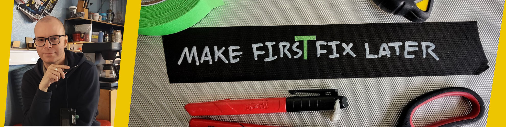

---
hide:
  - navigation
  - toc
  - path
---




# Innovating at the Intersection of Technology and Community

> As Director of Fab Lab Ísafjörður, I help bridge the gap between education, industry, and community through innovation and digital fabrication.
>
> My background spans electronics, communication, CAD, CNC machining, and programming, combining hands-on making with systems thinking.
>
> I’m passionate about using technology to drive meaningful change, foster collaboration, and support public sector innovation.

```yaml 
             .--.           .---.        .-.                   .-.                       .--.---.         
         .---|--|   .-.     | A |  .---. |~|    .--.     .---. |b|    .--.           .---|--|***|   .-.-.  .---.
      .--|===| h|---|_|--.__| S |--|:::| |n|-==-|==|---. |:::| |l|-==-|==|---.    .--|===|**|===|---|s|*|--|:::|
      |%%|ino| t|===| |~~|%%| C |--|   |_|v|CATS|  |___|-|   |_|e|MEME|  |___|-.|-|%%|txt|--|~m~|===|u|*|~~|   |
      |md|   | m|===| |==|  | I |  |:::|=|i|    |py|---|=|:::|=|n|****|nc|---|=||=|md|   |  | i |===|d| |==|:::|
      |  |   | l|css|_|__|  | I |__|bin| |m|    |  |svg|C|   | |d|    |  |hex| || |  |   |  | n |git|o| |__|zsh|
      |~~|===|--|===|~|~~|%%|~~~|--|:::|=|~|----|==|---|=|:::|=|~|----|==|---|=||=|~~|===|--|~t~|===|~|~|~~|:::|
      ^--^---'--^---^-^--^--^---'--^---^-^-^-==-^--^---^-'---^-^-^-==-^--^---^-'^-^--^---'--^---'---^-^-^--^---^
```
<!--inspired by hjw--> 


