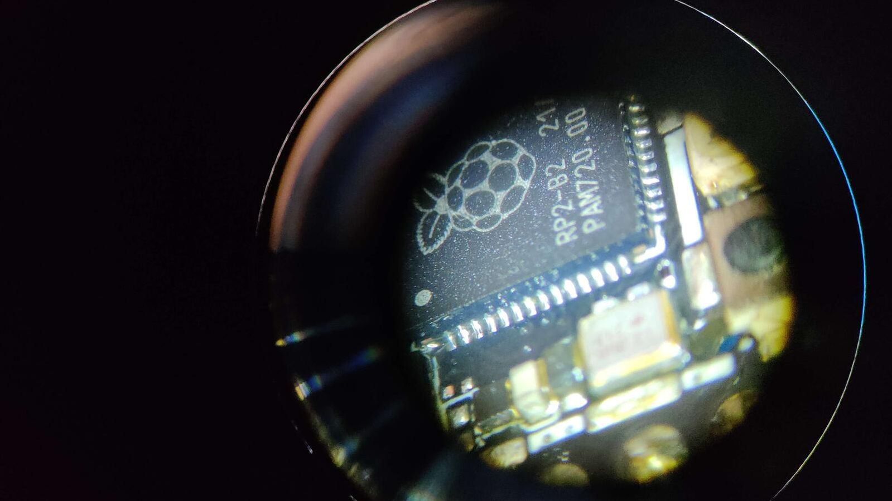
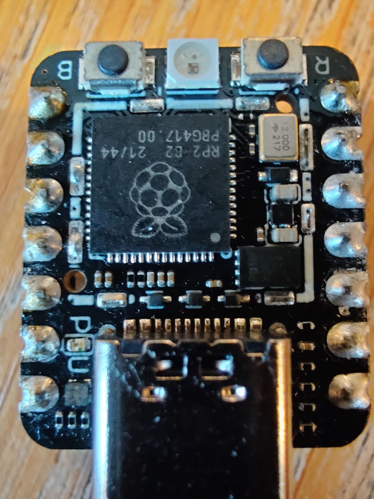
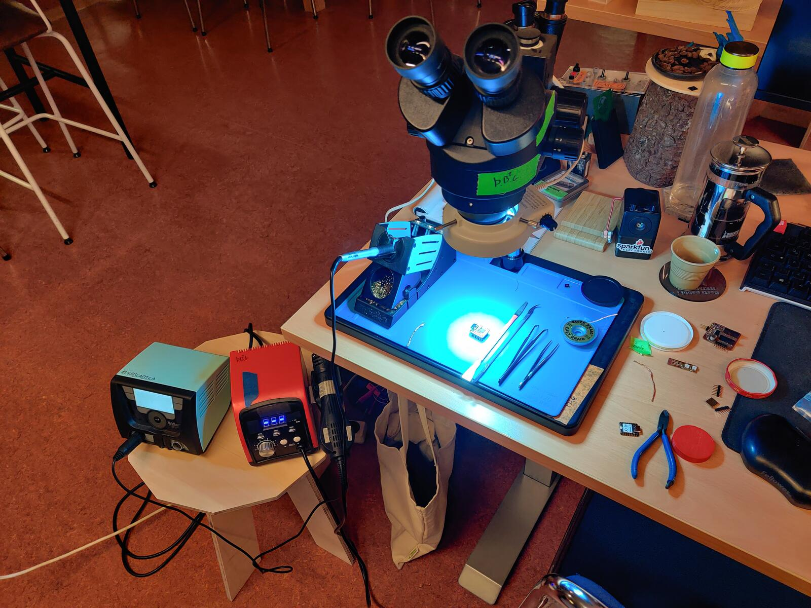

# Under the scope

It all started with me needing to run a quick test on an RP2040 board. Just a simple check. So I asked:   
**"Hey, do we have any spare RP2040 boards lying around?"**  

[Svavar](https://fabacademy.org/2023/labs/isafjordur/students/svavar-konradsson/index.html){:rel="nofollow"}, my ever-resourceful colleague, rummaged around and handed me a small stack. Among them was a Seeed Studio XIAO RP2040 he described as *“pretty much dead.”* It overheated almost instantly when plugged in and showed no signs of life over USB. He’d already tried the usual recovery tricks BOOTSEL mode, re-flashing but nothing worked.

Well, not nothing. The LED still lit up.

Naturally, I took that as **challenge accepted**.

<!-- more -->

## Initial inspection

The board in question was a **Seeed Studio XIAO RP2040**. When plugged in, both the **red power LED** and **blue user LED** lit up.
However, the RP2040 chip itself **was getting hot to the touch** within seconds of powering on. So my troubleshooting mode kicked in.

Here’s what I noted:

- **Visual:** No visible signs of damage or burns. The board does have an RF shield, so to fully investigate I’d need to remove it.
- **Heat:** Other than the RF shield being warm, it was hard to pinpoint the heat source it was just *hot*. The USB connector stayed cool.
- **Smell:** No burnt smell, no melting plastic, and nothing unusual in the air despite the heat.
- **Voltage:** Not a lot of obvious test points, but I measured both **3.3V** and **5V** and they seemed normal.
- **Terminal checks:** Running `lsusb`(list USB devices), `dmesg -w`(print the kernel ring buffer
), and `lsblk`(list block devices) showed the device as `"MicroPython Board in FS mode"`.
- **BOOTSEL test:** Holding BOOTSEL while plugging it in popped up a USB drive with `INFO_UF2.TXT` and `INDEX.HTM`. So the USB bootloader and power circuitry were still functional.

Dead hot silence but clearly something wasn’t right. Why was it cooking itself?

## Schematic diagnost

With no obvious external clues, it was time to head back to the drawing board, literally and dig into some schematics to get a better idea of the layout and pinpoint possible components that could be heating up.

I pulled up the schematic for the Seeed Studio XIAO RP2040 board, hoping to figure out what might be pulling so much current. The first suspects were the usual ones: the voltage regulator, the flash memory, a possible short in components like one of those tiny decoupling capacitors scattered around the RP2040, and of course the RP2040 itself.

The flash chip was easy to spot in the schematic: an 8-pin SPI chip wired to the QSPI lines on the RP2040. It runs directly off the 3.3V rail, so if it had shorted internally, that could easily explain the symptoms. Same goes for the voltage regulator if it had failed in a sneaky way, it might still output 3.3V but leak current somewhere inside.

I didn’t see anything obviously wrong, but the schematic gave me a solid mental map of what to probe next. The plan: start testing everything connected to 3.3V, especially around the RP2040 and the flash.

To access those points, I realized it was time to bring out some physical tools.

## Behind the shield

{: style="height:25%;width:25%" align=right}

Grabbing the hot air gun and getting to work, I removed the RF shield. And oh my... these were not the standard “large” components we all know and love, like the comfortable **0805** or even **0603** packages.
Nope. Welcome to the land of **0201** capacitors and some seriously tiny chips.

*If you’re reading this with no technical knowledge, well done you! 0201 means the component is 0.6mm × 0.3mm. That’s basically a grain of dust pretending to be a circuit.*

Once the shield was off, I could finally get a proper look at what was going on underneath. Nothing jumped out visually no burnt parts, no discoloration but now I had full access to probe components and really start hunting down the problem.

The plan was simple: power it briefly, watch closely, and find out what got hot first.

### The great isopropanol trick

This is by far one of the top tricks I’ve learned for troubleshooting. All you need is some isopropanol, easily available and a heat problem. Here’s how it goes.

I powered up the board briefly just a few seconds and dropped a little isopropanol over the surface. The alcohol evaporates faster where there’s heat, so it’s a great quick and dirty or clean way to spot hot components without any delay.
  
*Disclaimer: I don’t have a fancy thermal camera (a bit jealous, yes).*

The result? No question the RP2040 was the first thing to dry. Fast. Too fast. The surrounding components got hot later, but the MCU itself was clearly the heat source.

That more or less confirmed it: this wasn’t a passive component pulling too much current. This was likely **an internal failure inside the RP2040 itself** or **some capacitor** causing a short, making the 3.3V rail deliver all the current it could and turning it directly into heat.

Still, I wanted one more data point before going all in on a chip swap.

*Side note:* I also tested it the next day with a rosin atomizer. Same conclusion. Another great tool basically a slightly fancier version of the isopropanol trick.

## Low resistance = high current 

Knowing that heat usually means high current, and high current can’t flow unless resistance is low, I started probing around for confirmation. I began looking for obvious points of failure some of the capacitors looked suspicious, but nothing screamed "smoking gun."

Then I measured the 3.3V rail. **7 ohms.** That’s low. Way too low.

The 5V rail checked out fine, but that 3.3V line? Definitely something wrong there.

In hindsight, I probably should’ve done that measurement earlier. But sometimes you’ve got to circle the problem a few times before it shows itself. I confirmed my suspicion by measuring a known-good XIAO RP2040 board. The difference was obvious. Always nice to have a healthy reference board for moments like this.

So I grabbed the soldering iron and started removing suspects. First a couple of the suspicious capacitors, they were tiny, and I figured if one had shorted, that might explain it. But after removing two, I stopped. It just didn’t feel right. Those caps were easy to lose, and I didn’t think they were the real cause.

The prime suspect was still sitting there. Getting hot.

## Flash nuke: one last shot

Still hoping for a software miracle, I decided to give it one last shot before reaching for hot air.

I had come across a special file called [`flash_nuke.uf2`](https://github.com/dwelch67/raspberrypi-pico/blob/main/flash_nuke.uf2) a firmware designed to completely wipe the flash memory of an RP2040. If the board was stuck in some cursed `main.py` loop or MicroPython garbage left over from previous use, this would clear it out completely.

I dropped it onto the board in BOOTSEL mode. The upload worked fine. The board rebooted as expected.

Then… it got hot again.

Still the same symptom. RP2040 heating up within seconds. No change, no improvement, no relief.

At this point, the software had been ruled out. The voltages looked normal. The flash wasn’t hot. I had removed a couple of capacitors and confirmed the short was still there.

I thought to myself, *well, this is as far as I go at least until we can order spare chips*.  
I casually mentioned this to Svavar.

His response:  
**"Well, I already ordered spare RP2040 chips."**  
Of course he had.  

And just like that, he handed me a fresh RP2040.

There was really only one thing left to do take out the chip and go under the scope.

## Under the scope

{: style="height:50%;width:50%" align=right}

### Preparation

Time for surgery.

I gathered the tools: hot air station, microscope, flux, tweezers, soldering iron, solder paste, multimeter, and a bit of patience. The RP2040 is a QFN package, which means the pads are underneath not visible like your classic DIP or SOIC packages. You can still see them on the side so not impossible, but it still a bit demanding requiring focus.

### Chip removal

Not much to say here, this was the easy part.

I set the hot air to a safe temperature, being careful not to crank the airflow too high to avoid launching those microscopic dust-sized capacitors off the board. I held the RP2040 with tweezers and just let gravity do the work. A little nudge, and off it came.

### Soldering prep

After removing the chip, I cleaned the pads with some solder wick and isopropanol. The old solder came off nicely, leaving a clean surface to work with.

My solder paste was a bit thick, so I mixed in some fresh flux to make it easier to spread and flow. A thin layer across the pads, nothing fancy or too precise.

### Surface tension FTW

I placed the new RP2040 onto the footprint and carefully aligned it under the scope.

The magic of surface tension does a lot of the heavy lifting during reflow. As the solder melts, the chip gently pulls itself into perfect alignment. I love that moment it feels like the board is cooperating. After I saw the reflowing take place I nudged it a bit to get it perfectly aligned and then removed the heat and it was stuck in place.

### Clean-up and physical verification

Once everything cooled, I went in with the iron to touch up a few pads and clean up a couple of small solder bridges. Then came the double check:

- Visually inspected every side of the chip under the scope.
- Measured pins side by side with continuity test for shorts
  - Touched it up a few times until everything looked and measured well. 
- Probed 3.3V and GND again, no more short.

I was ready to power it up.

## Moment of truth: live test

Time to see if all that effort actually paid off.

First, I powered it from a USB power brick just to play it safe.  
**Normal red LED came on!**  
**No heat!**  
That was encouraging.

So I plugged it into my laptop. Opened `dmesg -w` and...  
Boom. It showed up! The system saw it. That moment felt great too bad I was alone at the time. I called my friend, who had been getting updates on the progress, just to share the win.

I flashed MicroPython onto it and uploaded a quick script. No errors.

Even though I was technically out of the woods, I just had to try uploading an Arduino sketch as well. Again, no errors. The board responded perfectly.

After all the measuring, heating, nudging, and reflowing, the mystery was solved. It really was the RP2040 all along likely shorted internally and quietly dumping current into heat. No external signs, just failure.

But now? The board was healthy again.

What caused it to fail in the first place?  
We’ll never know.

