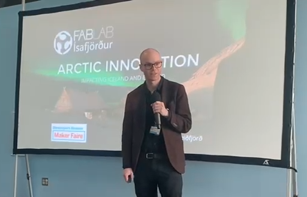

!!! info
    I'm in the proccess of documenting and have yet to add photos, links and more.

## The Journey to Shreveport-Bossier Maker Faire

In 2024, I received an invitation to join the [Shreveport-Bossier Maker Faire](https://shreveport.makerfaire.com/). I was excited to share how we use innovation and digital fabrication to empower people in remote regions of Iceland — through the network of Icelandic Fab Labs, which has been active since 2007 when the first lab opened in Vestmannaeyjar. I wanted to highlight how [Fab Lab Ísafjörður](https://fabisa.is) has made its mark and created local as well as global impact.

<!-- more -->

## Pre-Trip

Preparing for the trip took some effort — coordinating schedules, finishing projects at the lab, and planning the talk. The day before departure, I traveled to Reykjavík and spent the day at [Fab Lab Reykjavík](https://www.flr.is) to catch up with colleagues and narrow down what I could share at the Maker Faire.

I left Reykjavík early in the morning, flew through JFK and Atlanta, and finally arrived in Shreveport on Friday morning — after some delays and a missed connection. Tired, but excited. Joel picked me up at the airport in his Maker Van. He’s a true community engager like no other. On the same flight was Hunter, part of the [Power Racing Series](https://powerracingseries.org/), where people modify toy cars to race them at high speeds.

---

## Visiting Sci-Port

After the airport pickup, we went straight to [Sci-Port](https://sci-port.org/) to meet the Maker Faire team. Sci-Port is a discovery center with impressive exhibitions and a newly established Makerspace/STEM center.

Friday was spent setting up for the Faire. Because of the travel delays, I unfortunately missed a scheduled TV interview in the morning. But I got to meet many of the people I had connected with online — and that’s always a great moment.

---

## Giving the Keynote

On Saturday, I had the honor of delivering the keynote talk titled:

**_Arctic Innovation: Impacting Iceland and Beyond_**

I spoke about how innovation isn’t something that only happens in Silicon Valley or big research centers. It can happen in small, remote towns — even on the edge of the Arctic — when we create the right space and support system.

Using the metaphor of a sports stadium, I explored what it takes to build an "innovation stadium" — a place where people can train, collaborate, and thrive. I showed how our Fab Lab in Ísafjörður works as that kind of space, and I shared stories of people and projects from our community who are making a real impact.

---

## Slide Deck

Here are the slides from my keynote talk at the 2025 Shreveport-Bossier Maker Faire:

[Slide deck: Arctic Innovation – Impacting Iceland and Beyond](https://hanndoddi.github.io/makerfair_shreveport/index.html)

---

### Recap: Core Messages from the Talk

> **Innovation = Idea × Value**  
> Innovation happens when creativity meets relevance.

---

> **Ideas require** imagination, insight, curiosity, and courage.

---

> **Value is built on** relevance, feasibility, impact, sustainability, and timing.

---

> **Innovation needs a space** — like a stadium for sports, we need dedicated places (like Fab Labs) where ideas can be trained, tested, and shared.

---

> **Superstars don’t rise alone** — it takes roles, support, and systems to nurture innovation.

---

> **A strong network is like a relay team** — ideas move faster and go further when passed, not hoarded.

---

I also joined a panel discussion about the Maker Faire community and the role it plays in our local contexts.

---

## Reflections & Moments

The Maker Faire itself was a vibrant celebration of creativity. From robotics and CNC demos to handmade crafts and educational exhibits, it was inspiring to see so many people from different backgrounds building and sharing.

I met incredible makers, educators, and organizers, and heard about the unique challenges and opportunities in Louisiana's maker ecosystem. One thing was clear: the spirit of making is alive and well here.

---

## Gratitude

Huge thanks to the Maker Faire team for the warm welcome — and to everyone who made time to connect, share stories, and show me around.

Let’s keep the network going, whether it's across the Atlantic or just across town.

