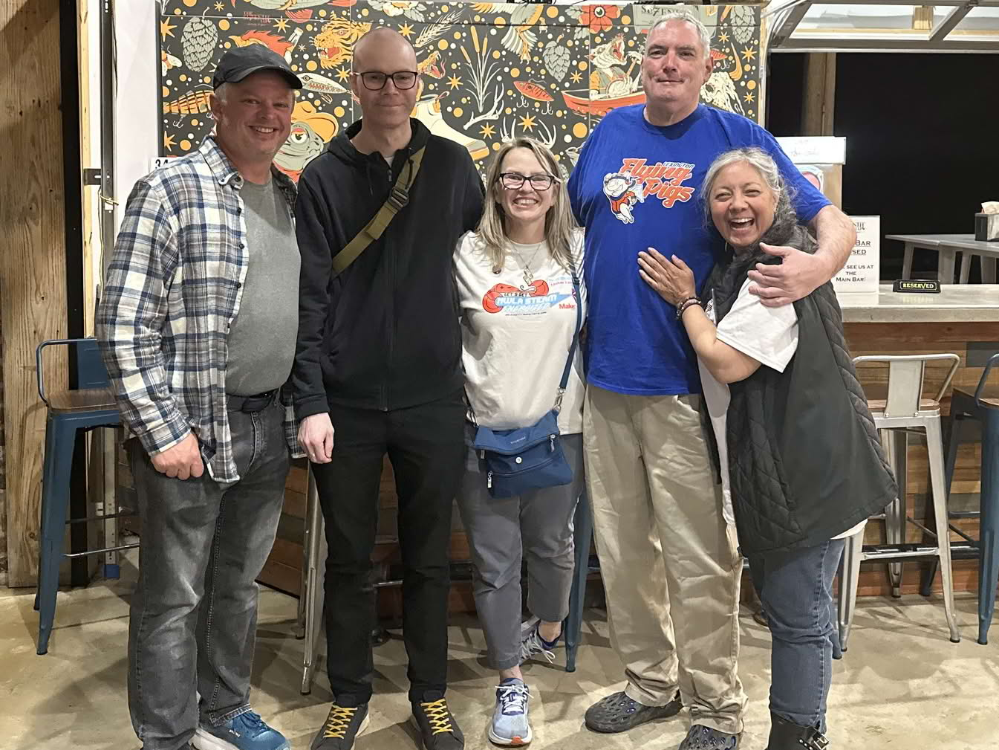

# Journey to Shreveport Bossier Maker Faire

In 2024, I received an invitation to join the [Shreveport-Bossier Maker Faire](https://shreveport.makerfaire.com/) . I was excited to share how we use innovation and digital fabrication to empower people in remote regions of Iceland, through the network of Icelandic Fab Labs, which has been active since 2007 when the first lab opened in Vestmannaeyjar. I wanted to highlight how [Fab Lab Ísafjörður](https://fabisa.is)  has made its mark and created local as well as global impact.

<!-- more -->

## Pre-Trip

Preparing for the trip took some effort, coordinating schedules, finishing projects at the lab, and planning the talk. The day before departure, I traveled to Reykjavík and spent the day at [Fab Lab Reykjavík](https://www.flr.is)  to catch up with colleagues and narrow down what I could share at the Maker Faire.

I left Reykjavík early in the morning, flew through JFK and Atlanta, and finally arrived in Shreveport on Friday morning after some delays and a missed connection. Tired, but excited. Joel picked me up at the airport in his Maker Van. He’s a true community engager like no other. On the same flight was Hunter, part of the [Power Racing Series](https://powerracingseries.org/), where people modify toy cars to race them at high speeds.

---

{: style="height:50%;width:50%" align=right} 

## Visiting Sci-Port

After the airport pickup, we went straight to [Sci-Port](https://sci-port.org/) to meet the Maker Faire team. Sci-Port is a discovery center with impressive exhibitions and a newly established Makerspace/STEM center.

Friday was spent setting up for the Faire. Because of the travel delays, I unfortunately missed a scheduled TV interview in the morning. But I got to meet many of the people I had connected with online, and that’s always a great moment.

  
### People I Met

**Clint Coleman** – Program Director, North Louisiana STEM Alliance  
[North Louisiana STEM Alliance (LaSTEM)](https://nlasteamalliance.org/)  promotes STEM education across the region by building collaborative programs and partnerships.

**Dianne M. Clark** – Executive Director, [Sci-Port Discovery Center](https://www.sci-port.org/)   
Leads the center in delivering hands-on science experiences to families, students, and schools throughout the region.

**Joel Leonard** – Maker Faire organizer / community engager  
Maker of the *Thorminator* and a passionate advocate for connecting makers around the world.

**Hunter  Leonard** – Power Racing Series  
Part of the [Power Racing Series](https://powerracingseries.org/) , where participants modify toy cars for high-speed racing a wild, fun, and creatively engineered spectacle.
This is [Hunters site personal site](https://subportspeakers.weebly.com/). Hunter works for [BETA technologies](https://beta.team/) An aerospace company manufacturing electric planes. 

**Jennifer Johnson** – STEM Education Coordinator, [Sci-Port Discovery Center](https://www.sci-port.org/)   
STEM education specialist focused on outreach, curriculum design, and hands-on learning experiences. Passionate about making science accessible and engaging for all ages.

**John Galiotos** – Southern University at Shreveport, Louisiana  
Works to advance applied STEM education and workforce development through technical programs and academic partnerships.

**Heather Kleiner** – Director, [Sci-Port Discovery Center](https://www.sci-port.org/)   
Oversees programs and initiatives that bridge science education, innovation, and public engagement.

**Nicola Mattis** – Founder and CMO, [Brand Engineer Studios](https://www.brandengineerstudios.com/)   
Works at the intersection of design, technology, and brand strategy helping creators and companies shape their identity and grow.

**Maria Esquela** – Founding member, [e-NABLE Alliance](https://enablingthefuture.org/)   
Part of a global volunteer movement that designs and distributes free 3D-printed prosthetics for people in need, especially children.

---

Meeting these people gave me a clearer view of how strong and diverse the maker community is here in Louisiana and reminded me how important it is to build networks across regions.

---

## Giving the Keynote

On Saturday, I had the honor of delivering the keynote talk titled:

**_Arctic Innovation: Impacting Iceland and Beyond_**

I spoke about how innovation isn’t something that only happens in Silicon Valley or big research centers. It can happen in small, remote towns, even on the edge of the Arctic where we create the right space and support system.

Using the metaphor of a sports stadium, I explored what it takes to build an "innovation stadium" a place where people can train, collaborate, and thrive. I showed how our Fab Lab in Ísafjörður works as that kind of space, and I shared stories of people and projects from our community who are making a real impact.

  
  

---

## Slide Deck

Here are the slides from my keynote talk at the 2025 Shreveport-Bossier Maker Faire:

<iframe src="https://hanndoddi.github.io/makerfair_shreveport/index.html" title="deck.js" width="600" height="350">
  
Your browser does not support iframes.

</iframe>

[Slide deck: Arctic Innovation – Impacting Iceland and Beyond](https://hanndoddi.github.io/makerfair_shreveport/index.html) 

---

### Recap: Core Messages from the Talk

> **Innovation = Idea × Value**  
> Innovation happens when creativity meets relevance.

---

> **Ideas require** imagination, insight, curiosity, and courage.

---

> **Value is built on** relevance, feasibility, impact, sustainability, and timing.

---

> **Innovation needs a space** like a stadium for sports, we need dedicated places (like Fab Labs) where ideas can be trained, tested, and shared.

---

> **Superstars don’t rise alone** it takes roles, support, and systems to nurture innovation.

---

> **A strong network is like a relay team** ideas move faster and go further when passed, not hoarded.

---

I also joined a panel discussion about the Maker Faire community and the role it plays in our local contexts.

---
{: style="height:50%;width:50%" align=right} 
## Reflections & Moments

The Maker Faire itself was a vibrant celebration of creativity. From robotics and CNC demos to handmade crafts and educational exhibits, it was inspiring to see so many people from different backgrounds building and sharing.

I met incredible makers, educators, and organizers, and heard about the unique challenges and opportunities in Louisiana's maker ecosystem. One thing was clear: the spirit of making is alive and well here.

  

---

## Gratitude

Huge thanks to the Maker Faire team for the warm welcome, and to everyone who made time to connect, share stories, and show me around.

Let’s keep the network going, whether it's across the Atlantic or just across town.

